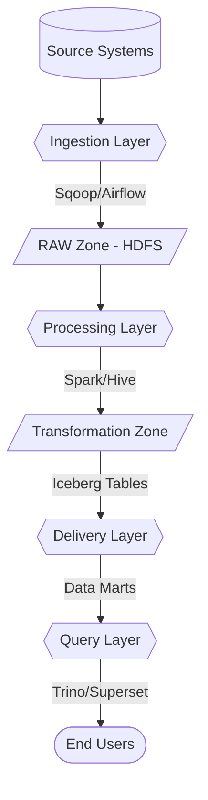

# DX House Architecture Documentation

Comprehensive architecture documentation for the Data-X-House unified data management platform.

## Table of Contents

1. [Overview](#overview)
2. [Seven-Layer Architecture](#seven-layer-architecture)
3. [Technology Stack](#technology-stack)
4. [Data Flow](#data-flow)
5. [DLAF Framework Extension](#dlaf-framework-extension)
6. [Deployment Architecture](#deployment-architecture)

---

## Overview

DX House is a unified lakehouse architecture that combines data lake and data warehouse capabilities for on-premise big data platforms in highly regulated sectors.

### Key Features

- **Unified Storage**: Single platform for structured, semi-structured, and unstructured data
- **ACID Transactions**: Apache Iceberg for transactional consistency
- **Security & Governance**: Enterprise-level compliance (GDPR, HIPAA, PCI-DSS, SOX)
- **Flexible Deployment**: On-premise or cloud with Docker containerization
- **Performance**: 7.6x query speedup with Trino vs Hive

### Design Principles

1. **Separation of Concerns**: Clear layer boundaries and responsibilities
2. **Scalability**: Horizontal scaling through distributed architecture
3. **Security by Design**: Encryption, access control, and audit logging
4. **Flexibility**: Support for multiple data formats and processing engines
5. **Interoperability**: Standard interfaces and protocols

---

## Seven-Layer Architecture

### Layer 1: Ingestion Layer

**Purpose**: Extract data from various sources and load into raw storage

**Components**:
- **Apache Sqoop**: JDBC-based batch ingestion
- **Apache Airflow**: Workflow orchestration
- **Custom Scripts**: Incremental ingestion logic

**Data Sources**:
- Relational databases (MySQL, PostgreSQL, Oracle)
- File systems (CSV, JSON, Parquet)
- APIs and web services
- Streaming sources (Kafka, future)

**Storage Zones**:
- **RAW Zone**: `/storage/tpch/{table}/year/month/day/hour`
- **Format**: Text files with Snappy compression
- **Partitioning**: Time-based (year/month/day/hour)

**Performance**:
- Throughput: 0.04 - 15.4 MB/s
- Parallel processing: 1-6 mappers per table
- Compression ratio: ~2:1 with Snappy

### Layer 2: Storage Layer

**Purpose**: Distributed, scalable, and reliable data storage

**Components**:
- **HDFS 3.3.6**: Distributed file system
- **Apache Iceberg 1.3.1**: Table format with ACID support
- **Hadoop KMS**: Encryption key management

**Storage Zones**:
1. **RAW Zone**: Ingested data in original format
2. **Transformation Zone**: Processed data (datawarehouse, sandbox)
3. **Delivery Zone**: Business-ready data marts

**Features**:
- **Replication**: Factor of 2 across 3 data nodes
- **Encryption at Rest**: Hadoop KMS with security zones
- **Compression**: Snappy for balance, Parquet for efficiency
- **Partitioning**: Date-based for query optimization

**Storage Efficiency**:
- Parquet to Iceberg: 173% - 255% efficiency gains
- Average improvement: ~215%
- Best compression: partsupp table (255%)

### Layer 3: Processing & Analysis Layer

**Purpose**: Transform raw data into analytical formats

**Components**:
- **Apache Spark 3.4.2**: Distributed data processing
- **Apache Hive 3.1.3**: SQL-based data warehouse

**Databases**:
1. **datawarehouse**: Star schema for analytics
   - Fact table: `fact_sales` (partitioned by date)
   - Dimensions: customer, supplier, part, order, geography, time
2. **sandbox**: ML/AI experimentation zone
   - Sentiment analysis on customer comments
   - Feature engineering for predictive models
3. **delivery**: Business-specific data marts
   - sales_by_customer, sales_by_region, sales_summary

**Processing Patterns**:
- **Batch Processing**: Spark jobs for ETL
- **SQL Processing**: Hive for data warehouse operations
- **Stream Processing**: Future support for real-time analytics

### Layer 4: Archive Layer

**Purpose**: Cost-effective long-term storage (future implementation)

**Planned Features**:
- Cold storage for historical data
- Tiered storage policies
- Automated data lifecycle management
- Compression and deduplication

### Layer 5: Delivery Layer

**Purpose**: Provide data access to end users and applications

**Components**:
- **Trino 477**: High-performance SQL query engine
- **Apache Superset 5.0.0**: BI dashboards and visualization
- **Hue 4.11**: SQL editor and HDFS browser
- **APIs**: REST endpoints for programmatic access

**Query Performance**:
- Trino vs Hive: 7.6x speedup
- Simple queries: 15s → 2s
- Complex joins: 1207s → 159s (20 min → 2.6 min)

**Access Methods**:
- **Interactive Queries**: Trino via Hue or CLI
- **Batch Queries**: Hive for large-scale processing
- **Dashboards**: Superset for business users
- **Notebooks**: Jupyter for data scientists (future)

### Layer 6: Metadata & Governance Layer

**Purpose**: Unified metadata management and data governance

**Components**:
- **Apache Gravitino 0.7.0**: Unified metadata catalog
- **Hive Metastore**: Table and schema metadata
- **Apache Atlas** (future): Data lineage and discovery

**Metadata Types**:
1. **Technical Metadata**: Schemas, tables, columns, data types
2. **Operational Metadata**: Job history, data lineage, quality metrics
3. **Business Metadata**: Glossary, tags, descriptions

**Governance Features**:
- Schema evolution tracking
- Data lineage visualization
- Metadata search and discovery
- Cross-catalog federation

### Layer 7: Security & Administration Layer

**Purpose**: Comprehensive security and cluster management

**Components**:
- **Apache Ranger 2.7.0**: Fine-grained access control
- **Hadoop KMS**: Encryption key management
- **YARN**: Resource management
- **Monitoring Tools**: Cluster health and performance

**Security Features**:
1. **Authentication**: User identity verification
2. **Authorization**: Role-based access control (RBAC)
3. **Encryption at Rest**: Hadoop KMS with security zones
4. **Encryption in Transit**: SSL/TLS for all communications
5. **Audit Logging**: Comprehensive activity tracking
6. **Data Masking**: Dynamic masking for sensitive data

**Compliance**:
- GDPR (General Data Protection Regulation)
- HIPAA (Health Insurance Portability and Accountability Act)
- PCI-DSS (Payment Card Industry Data Security Standard)
- SOX (Sarbanes-Oxley Act)
- ISO 27001 (Information Security Management)

---

## Technology Stack

### Core Technologies

| Layer | Technology | Version | Purpose |
|-------|------------|---------|---------|
| **Storage** | HDFS | 3.3.6 | Distributed file system |
| | Apache Iceberg | 1.3.1 | Table format with ACID |
| | Hadoop KMS | 3.3.6 | Encryption key management |
| **Processing** | Apache Spark | 3.4.2 | Distributed data processing |
| | Apache Hive | 3.1.3 | SQL data warehouse |
| **Ingestion** | Apache Sqoop | 1.4.7 | JDBC data ingestion |
| | Apache Airflow | 3.0.6 | Workflow orchestration |
| **Query** | Trino | 477 | High-performance SQL engine |
| **Security** | Apache Ranger | 2.7.0 | Access control & policies |
| **Metadata** | Apache Gravitino | 0.7.0 | Unified metadata catalog |
| **Visualization** | Apache Superset | 5.0.0 | BI dashboards |
| | Hue | 4.11 | SQL editor & file browser |
| **Container** | Docker | 20.10+ | Containerization platform |
| **OS** | CentOS | 7 | Operating system |

### Supporting Technologies

- **MySQL 8.0**: Hive Metastore backend
- **Python 3.11**: Scripting and Airflow
- **Java 8/11**: Hadoop ecosystem
- **Scala 2.12**: Spark applications

---

## Data Flow

### End-to-End Pipeline

### Batch Ingestion Flow

1. **Airflow triggers** `batch_ingestion_dag`
2. **Sqoop extracts** data from MySQL
3. **Data lands** in HDFS RAW zone with partitioning
4. **Hive external table** created/updated
5. **Partitions repaired** automatically

### Transformation Flow

1. **Airflow triggers** `init_datawarehouse`
2. **Spark creates** star schema (Iceberg format)
3. **Spark populates** fact and dimension tables
4. **Data validated** for quality and integrity
5. **Metadata updated** in Hive Metastore

### Delivery Flow

1. **Airflow triggers** `build_datamart_delivery`
2. **Spark aggregates** data from datawarehouse
3. **Data marts created** in delivery database
4. **Superset connects** to delivery tables
5. **Dashboards updated** for end users

---

## DLAF Framework Extension

DX House extends the Data Lake Architecture Framework (DLAF) from 9 to 11 aspects:

### Original 9 Aspects

1. **Data Sources**: Multiple source types and protocols
2. **Data Ingestion**: Batch and streaming ingestion
3. **Data Storage**: Distributed file system (HDFS)
5. **Data Governance**: Metadata and lineage
6. **Data Security**: Encryption and access control
7. **Data Quality**: Validation and profiling
8. **Data Catalog**: Metadata management
9. **Data Consumption**: Query engines and BI tools

### New Aspects (10 & 11)

10. **Data Delivery**: Dedicated layer for business-ready data
    - Data marts for specific use cases
    - Optimized for consumption
    - Separate from transformation layer

11. **Data Orchestration**: Workflow management and automation
    - Apache Airflow for pipeline orchestration
    - Automated scheduling and monitoring
    - Error handling and retry logic

---

## Deployment Architecture

### Physical Deployment

**4-Node Cluster Configuration**:

| Node | Role | CPU | RAM | Disk | Services |
|------|------|-----|-----|------|----------|
| dx-master | Master | 5 cores | 12 GB | 200 GB | NameNode, ResourceManager, Hive Metastore, Spark Master |
| dx-worker1 | Worker | 5 cores | 8 GB | 100 GB | DataNode, NodeManager, Spark Worker |
| dx-worker2 | Worker | 5 cores | 8 GB | 100 GB | DataNode, NodeManager, Spark Worker |
| dx-worker3 | Worker/Admin | 5 cores | 18 GB | 200 GB | DataNode, NodeManager, Spark Worker, Airflow, Superset, Hue, Ranger, Gravitino, Trino |

### Network Architecture

- **Internal Network**: 10.0.0.0/24 (cluster communication)
- **External Network**: Public IPs for web interfaces
- **Firewall Rules**: Restricted access to admin ports

### Service Ports

| Service | Port | Access |
|---------|------|--------|
| HDFS NameNode | 9870 | Web UI |
| YARN ResourceManager | 8088 | Web UI |
| Hive Metastore | 9083 | Thrift |
| Spark Master | 7077 | Spark |
| Spark UI | 8080 | Web UI |
| Airflow | 8082 | Web UI |
| Superset | 9099 | Web UI |
| Hue | 8888 | Web UI |
| Ranger | 6080 | Web UI |
| Gravitino | 7070 | Web UI |
| Trino | 8090 | Web UI |

### Docker Deployment

**Container Strategy**:
- Single custom image: `dxhouse-cls:latest`
- Contains all services pre-configured
- Entrypoint script starts required services per node
- Persistent volumes for data and logs

**Advantages**:
- Consistent environment across nodes
- Easy deployment and scaling
- Version control for entire stack
- Simplified backup and recovery

---

## Scalability Considerations

### Horizontal Scaling

- **Add DataNodes**: Increase storage capacity
- **Add NodeManagers**: Increase processing capacity
- **Add Trino Workers**: Improve query performance
- **Rebalance HDFS**: Distribute data evenly

### Vertical Scaling

- **Increase RAM**: Better caching and performance
- **Add CPU cores**: More parallel processing
- **Faster disks**: Improved I/O performance
- **Network upgrades**: Higher throughput

### Performance Optimization

1. **Partitioning**: Date-based for time-series data
2. **Compression**: Snappy for balance, Parquet for size
3. **Caching**: Frequently accessed data in memory
4. **Indexing**: Secondary indexes for common queries
5. **Query Engine**: Use Trino for interactive queries

---

## Future Enhancements

### Planned Features

1. **Streaming Ingestion**: Apache Kafka integration
2. **Real-time Analytics**: Stream processing with Spark Streaming
3. **ML Pipeline**: Integrated machine learning workflows
4. **Data Lineage**: Apache Atlas for end-to-end tracking
5. **Auto-scaling**: Dynamic resource allocation
6. **Multi-tenancy**: Isolated environments for different teams
7. **Cloud Integration**: Hybrid cloud deployment options

### Research Directions

1. **AI-driven Optimization**: Automated query and storage optimization
2. **Blockchain Integration**: Immutable audit trails
3. **Quantum-ready**: Preparation for quantum computing
4. **Edge Computing**: Distributed data processing at edge locations

---

**Last Updated**: December 1, 2025
**Version**: 1.0  
